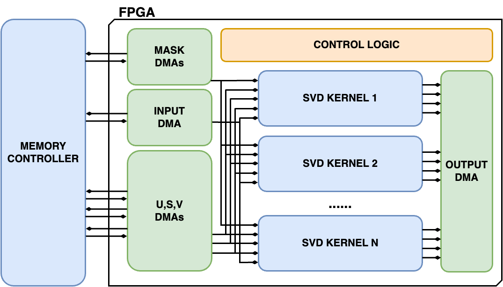
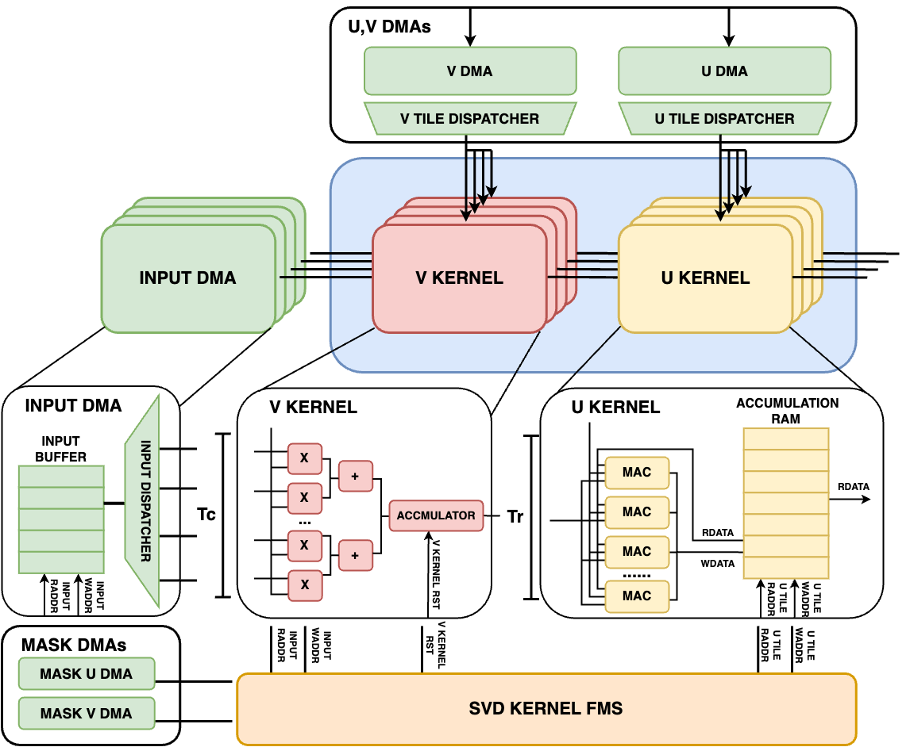
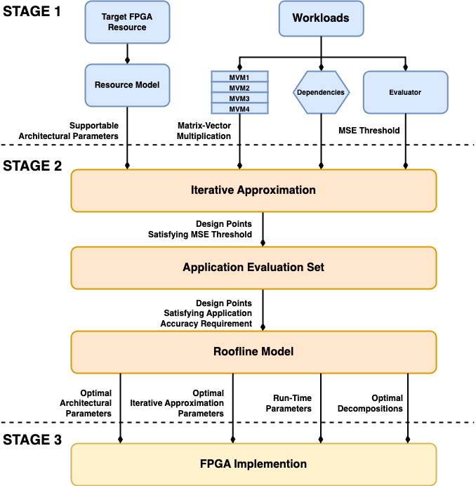

# Reconfigurable Computing for Approximate Matrix-Vector Multiplication
## A Hardware-Software Co-Design Approach

## Abstract
Matrix-vector multiplications are fundamental to a wide range of computational tasks, particularly in machine learning and scientific computing. When deployed on FPGA, these operations can become memory-bound when a large volume of matrices cannot be stored on-chip and has to be retrieved from off-chip. The project aims to address this challenge through a hardware-software co-design framework. Utilising various compression techniques, the framework aims to exploit the inherent redundancies in the given matrices to reduce memory requirements while considering the computational structure of the operations. From a hardware perspective, the framework employs a library of compression-aware and parametrisable compute engines to generate an accelerator that optimises hardware utilisation and computation latency. Given a set of matrix-vector multiplications with matrices and their input vectors, certain application accuracy requirements, and a target FPGA platform, the framework generates matrix decompositions and their corresponding hardware accelerators that minimise the latency of computing these matrix-vector products under hardware resource constraints.

## Directory Structure
**Simualtion/** contains simulation files and results for this project

**des_result/** contains design space exploration .csv files

**iterative_approximation/** contains source code for a library of iterative approximation methods used in the project

**utils/** contains utility scripts for matrix approximation

**hardware/** contains hardware source code and related files (under development)

## Iterative Approximation

## Accelerator Architecture
The accelerator supports a library of compression-aware SVD kernels tailored to different approximation strategies as discussed in Chapter 3. The architectural parameter NSVD kernel indicates the number of SVD kernels in the accelerator. Each kernel is designed to receive a continuous stream of decomposed matrix tiles from the DMAs and perform approximate MVMs. The accelerator supports both homogeneous and heterogeneous configurations:
  • **Homogeneous Configuration:** All SVD kernels utilise the same approximation strategy and have the same level of parallelism, providing a uniform approach to all MVMs.
  • **Heterogeneous Configuration:** Each SVD kernel is tailored to different approximation strategies with varying levels of parallelism. This flexibility allows the accelerator to efficiently handle MVM workload across a range of matrix sizes.
  

## SVD Kernel Architecture
The SVD kernel can support Nmvm matrix-vector multiplications. The SVD kernel is parametrisable with respect to parameter **Tr**, **Tc** and **Nmvm**.

## Framework

In **stage 1**, the framework decomposes the workload into a sequence of matrix-vector operations and identifying critical targets and dependencies that govern the sequence. These dependencies and targets pose constraints on how the matrices can be approximated. Concurrently, the Evaluator leverages the application’s evaluation dataset to determine a MSE threshold for iterative approximation that aligns with the application-level accuracy requirements. Given the FPGA hardware resources, such as the number of DSPs and BRAMs, the framework narrows down the design space by identifying the feasible number of SVD kernels (NSVD kernel) and the extent of parallelism (Tr and Tc) achievable within each engine. To estimate resource utilisation without actual hardware implementation, an analytical resource model is developed. Design points that consume excessive resources are eliminated. The remaining design points which satisfies the resource constraint proceed to the next step.

In **stage 2**, the framework applies a collection of iterative approximation strategies and determines a set of design points that satisfy the specified MSE threshold. These design points are evaluated using the application evaluation dataset. Design points that do not meet the application-level accuracy targets are discarded. The design points that satisfies the application-level accuracy requirements are selected for design space exploration. For these selected design points, roofline models are instantiated, and their theoretical performance is estimated. The framework then performs design space exploration to identify the design point that achieves the lowest latency while meeting both application-level accuracy requirements and hardware resource constraints.

In **stage 3**, the FPGA architectural parameters of the selected design point are used to configure the hardware accelerator. The matrix decompositions are then loaded into the off-chip memory of the target FPGA for acceleration.
